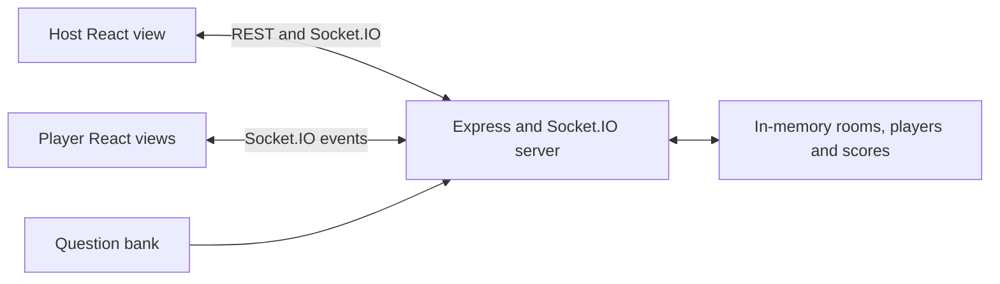

# Quizzes by Iron

A real-time multiplayer quiz application with host-controlled rooms, server-side scoring, timed questions, and live leaderboards.

## Why this project exists

A shared quiz needs host and player screens to agree on question state, timing, submissions, and scores. This project explores that coordination through a small event-driven Node.js backend and separate React views.

## Architecture



REST creates rooms and returns room metadata. Socket.IO carries game events. State lives in one server process; there is no database or cross-instance synchronization.

## Engineering Highlights

- Six-character room codes and QR join links connect host and player workflows.
- The server starts question timers, evaluates answers, and calculates points from elapsed time.
- Separate events report question changes, individual answer feedback, submission counts, and leaderboard updates.
- Duplicate submissions are ignored per socket during a question, while duplicate player names are rejected in the lobby.

## Tech Stack

| Area | Technologies |
| --- | --- |
| Backend | Node.js, Express, Socket.IO |
| Frontend | React, React Router, Vite, Socket.IO client |
| Interface | CSS, Lucide icons, QRCode React |

## How It Works

The host creates a room; players join with a name and room code. Starting the game broadcasts a question with a 20-second window. The server scores submissions and ends the question when time expires or the recorded answer count reaches the player count. The host advances questions, displays the leaderboard, or restarts the game.

Rooms disappear when the host disconnects or the server restarts. Player identities use socket IDs; reconnect continuity is not implemented.

## Setup

Use **Node.js 22.12+**. The locked frontend Vite dependency requires `^20.19.0 || >=22.12.0`.

```sh
git clone https://github.com/yashwant938/quizzesbyiron.git
cd quizzesbyiron/backend
npm ci
npm start
```

In a second terminal, from the repository root:

```sh
cd frontend
npm ci
npm run dev
```

Open [localhost:5173](http://localhost:5173). The backend defaults to port `3001`; `PORT` changes it. The frontend defaults to the browser hostname on port `3001`; set `VITE_BACKEND_URL` in `frontend/.env.local` for a different backend and restart Vite.

Frontend checks are `npm run lint` and `npm run build` from `frontend/`. No automated backend or end-to-end test suite is included.

## Example

Open the app in two browser tabs. Create a room in the first tab, join its code with a player name in the second, and start the game from the host view. Submit an answer, inspect the feedback and updated score, then advance to the next question.

## Engineering Challenges

- Coordinating host-controlled transitions with server timers and asynchronous answer events.
- Keeping host and player screens consistent through room-scoped broadcasts and individual feedback.
- Managing lifecycle cleanup: the server removes disconnected players and clears the timer when a host leaves.

## Future Improvements

- Add authenticated host ownership, server-side event validation, rate limits, and explicit CORS allowlists. Current CORS is permissive and host joining is unauthenticated.
- Persist rooms and introduce stable player identities, reconnect recovery, and a shared store before running multiple server instances.
- Test timer/transition races, forged submissions, disconnects, and scoring; measure latency and capacity before making performance claims.
